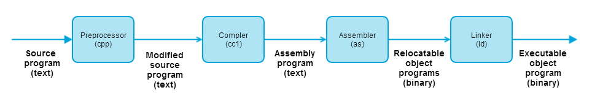

## Information Is Bits + Context

All information in a system -- include disk files, programs stored in memory, user data stored in memory, and data transferred across a network -- is represented as **a bunch of bits**. The only thing that distinguishes different data objects is the **context** in which we view them.

For example, in different contexts, the same sequence of bytes might represent an integer, floating-point number, character string, or machine instruction.

## Programs Are Translated by Other Programs into Different Forms

A high-level C program is readable for human beings. However, in order to run it on the system, the individual C statements must be translated by other programs into a sequences of low-level *machine-language* instructions. These instructions are packages in a form called *executable object program* and stored as a binary disk file.Object programs are also referred to as *executable object files*.

On a Unix system, the translation from source file to object file is performed by a *compiler driver*:

```unix> gcc -o object_file source_file.c```

The translation is performed in the sequence of four phases shown in the figure below. The programs that perform the four phases(preprocessor, compiler, assembler, and linker) are known collectively as the compilation system.



* **Preprocessor phase** . The preprocessor (cpp) modifies the original C program according to the directives that begin with the `#` character. The result is another C program, typically with the `.i` suffix.

* **Compilation phase** . The compiler (cc1) translate the text file(`.i`) into the text file(`.s`), which contains the assembly-language program.

* **Assembly phase** . Next, the assembler (as) translates file(`.s`) into machine-language instructions, packages them in a form known as a *relocatable object program*, and stores the result in the object file(`.o`)

* **Linking phase** .

## It pays to Understand How Compilation Systems Work

## Processors Read and Interpret Instructions Stored in Memony

## Caches Matter

## Storage Devices Form a Hierarchy

## The Operating System Manages the Hardware

## Systems Communicate with Other Systems Using Networks
